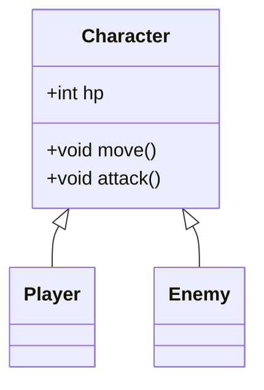

# 5. 詳細設計書テンプレート

## 1. クラス・モジュール設計
### クラス図 / 構成図
*   [クラスの継承関係や依存関係を記述（Mermaid記法推奨）]


### 主要クラス定義
*   **PlayerManager**: [プレイヤーの状態管理、入力処理]
*   **GameManager**: [ゲーム全体の進行管理、シーン遷移]
*   **EnemyAI**: [敵の思考ロジック]

---

## 2. データ構造設計
### データベース / マスタデータ
*   **ItemTable**: [ID, Name, Type, EffectValue, Price]
*   **EnemyTable**: [ID, Name, HP, Attack, Exp]

### セーブデータ構造（JSON/Binary）
```json
{
  "playerId": "user123",
  "level": 10,
  "inventory": [
    {"itemId": 101, "count": 5},
    {"itemId": 205, "count": 1}
  ]
}
```

---

## 3. アルゴリズム・処理フロー
### 主要な処理ロジック
*   **ダメージ計算式**: `(攻撃力 - 防御力) * ランダム係数`
*   **レベルアップ計算式**: `必要経験値 = 現在レベル * 100 * 1.5`

### フローチャート（状態遷移）
*   [敵の行動AIなど複雑な処理の流れ]
*   [例：索敵 → 発見 → 追跡 → 攻撃範囲内？ → 攻撃]

---

## 4. インターフェース・通信設計
### API定義（サーバー通信がある場合）
*   `POST /api/login`: [ログイン処理]
*   `POST /api/save`: [セーブデータ送信]

### イベント・メッセージ
*   **OnPlayerDead**: [プレイヤー死亡時に発行されるイベント]
*   **OnStageClear**: [ステージクリア時に発行されるイベント]

---

## 5. 堅牢性・モバイル対応設計
### モバイル考慮事項
*   [ ] **タッチ操作**: クリックイベントだけでなくタッチイベントも処理しているか？
*   [ ] **画面サイズ**: 異なるアスペクト比（iPhone, iPad）でもUIが崩れないか？
*   [ ] **中断復帰**: バックグラウンドに行って戻ってきた時に音が二重再生されないか？

### エラーハンドリング
*   [ ] **アセット欠落**: 画像/音がロードできなかった場合の挙動（デフォルト表示など）
*   [ ] **通信エラー**: サーバー通信失敗時のリトライ処理

---

## 6. コーディング規約・命名規則
*   **変数名**: [camelCase]
*   **クラス名**: [PascalCase]
*   **定数名**: [UPPER_SNAKE_CASE]
*   **コメント**: [publicメソッドには必ずドキュメントコメントを記述]
