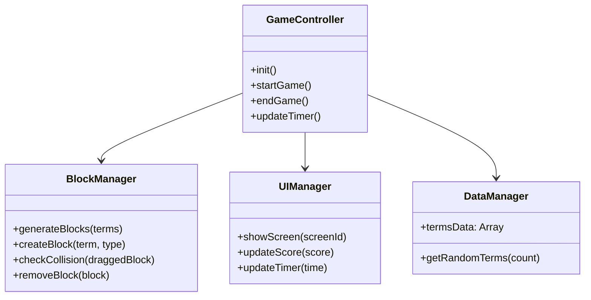

# 5. 詳細設計書: 民法パズル

## 1. クラス・モジュール設計 (JavaScript)

今回はVanilla JSでの実装のため、クラスベースではなくモジュール分割（機能ごとの関数群）を基本とするが、概念的な役割分担は以下の通り。

### 構成図


---

## 2. データ構造設計

### 用語データ (Terms Data)
`script.js` 内の定数として保持（将来的にはJSONファイル化）。

```javascript
const termsData = [
    { 
        id: 1, 
        term: "善意", 
        definition: "ある事情を知らないこと",
        category: "総則",
        difficulty: 1
    },
    // ...
];
```

### ゲーム状態 (Game State)
```javascript
let gameState = {
    score: 0,
    timeLeft: 60,
    isPlaying: false,
    currentLevel: 1,
    activeBlocks: [] // 現在画面にあるブロックのDOM要素
};
```

---

## 3. アルゴリズム・処理フロー

### マッチング判定ロジック
1.  **ドラッグ終了時 (`mouseup`/`touchend`)**:
    *   ドラッグしていたブロックの矩形 (`getBoundingClientRect`) を取得。
    *   画面上の**対になるタイプ**（用語なら定義、定義なら用語）の全ブロックの矩形を取得。
    *   **衝突判定**: `isOverlapping` 関数で重なりをチェック。
    *   **ID判定**: 重なっている場合、`dataset.id` が一致するか確認。
        *   **一致**: `handleMatch` を呼び出し、スコア加算、エフェクト再生、ブロック削除。
        *   **不一致**: 何もしない（元の位置に戻す処理を入れても良い）。

### 難易度調整アルゴリズム
*   **レベル1**: 3ペア出現。制限時間30秒。
*   **レベル2**: 5ペア出現。制限時間45秒。
*   **レベル3**: 8ペア出現。制限時間60秒。ダミーブロック（正解のないブロック）が出現する可能性あり。

---

## 4. コーディング規約
*   **変数名**: `camelCase` (例: `activeBlocks`, `termsData`)
*   **関数名**: 動詞から始める (例: `createBlock`, `startGame`)
*   **定数**: `UPPER_SNAKE_CASE` は使用せず、`const` で定義するが通常の変数と同じ命名規則とする（JSの慣習）。
